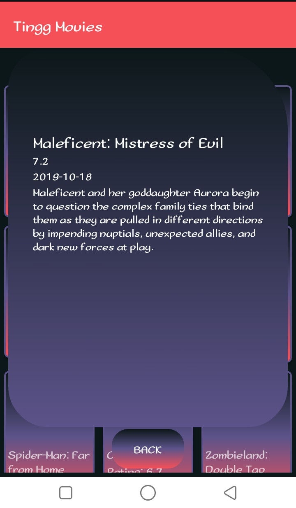

# Tingg - Movies -V 1.0.0

This is a movies application that gets movies from an api and displays them on the application. One can get to view movies and click on one to view more details about the movie.

## You can find an APK directory containing an apk file to install from the root directory of the application.

  NB: The images from the api do not display
  
  
  
  

## Author

* **Arnold Oduma**


### Prerequisites

You need the following installed on your machine
  - java
  - JDK - Java Development Kit
  - Maven
  - Gradle
  - An IDE - Android Studio
  ​

To confirm run the following command on linux
```
$ java --version       //java version
$ mvn --version        //maven version
$ gradle --version     //gradle version
```

## Installation
Clone this repository and import into **Android Studio**
```bash
git clone https://github.com/ArnoldOduma/tingg-movies.git
```

## Generating APK
From Android Studio go to:
1. ***Build*** menu
2. ***Generate APK***

and go to the  ***build/output/apk***

## Maintainers
This project is mantained by:
* [Arnold Oduma](https://arnoldoduma.github.io/portfolio/)


### -*Initial works*-

  - [Cook It](https://github.com/ArnoldOduma/coook-it) - An app to get view and search recipes
  - [Quotes](https://github.com/ArnoldOduma/quotes) - An app that enables a user create quotes and delete quotes they don't want
  - [Goals](https://github.com/ArnoldOduma/goals-application) - This is an application to create goals and checkout the ones you completed
  - [Pig Dice](https://github.com/ArnoldOduma/Pig-Dice) - This is a simole java script game of pigdice
  - [Delani Studio](https://github.com/ArnoldOduma/Delani_Studio) - A front end of a studio website
  - [Triangle Tracker](https://github.com/ArnoldOduma/triangle-tracker) - Tracks what type a triangle is by checking its length width and height
  - [portfolio](https://github.com/ArnoldOduma/portfolio) - My portfolio website


## Contributing

1. Fork it
2. Create your feature branch (git checkout -b my-new-feature)
3. Commit your changes (git commit -m 'Add some feature')
4. Run the linter (ruby lint.rb').
6. Create a new Pull Request
